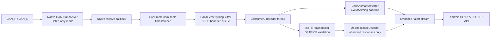

# สถาปัตยกรรม Passive CAN / ISO-TP / UDS Evidence Engine

เอกสารนี้อธิบายรากฐานสำหรับรับข้อมูล CAN แบบ **อ่านอย่างเดียว (passive / listen-only)**
ในแอป OBD2 LPG Data Logger โดยเน้น telemetry, การประกอบ ISO-TP, การตรวจหาความผิดปกติ
และการตีความ UDS response ที่สังเกตได้จากบัสจริงหรือไฟล์ replay

## ขอบเขตความปลอดภัย

ส่วนประกอบนี้ไม่มี API สำหรับส่ง Raw CAN frame, สลับ Diagnostic Session, Security Access,
การอ่าน/เขียนหน่วยความจำ, การแฟลช ECU หรือการ reset controller อัตโนมัติ การกระทำเหล่านั้น
อาจกระทบความปลอดภัยในการขับขี่ ความพร้อมใช้งานของรถ และข้อกำหนดของผู้ผลิต จึงต้องอยู่ใน
เครื่องมือศูนย์บริการที่ได้รับอนุญาต แยกจาก pipeline นี้อย่างเด็ดขาด

สิ่งที่ระบบนี้ทำได้คือเก็บหลักฐานเชิงรับ, ตรวจความต่อเนื่องของ transport และแจ้งสัญญาณ
ผิดปกติให้ผู้ใช้ตรวจสอบต่อ ไม่ได้สรุปว่า frame ใดเป็นการโจมตีโดยอัตโนมัติ

## 1. System Topology



ลำดับเวลาสำคัญมีดังนี้

1. Transceiver ที่เป็น native driver ส่งเฉพาะ frame ที่รับได้เข้ามายัง callback พร้อม timestamp ระดับ nanosecond ที่มาจาก controller หรือ monotonic clock
2. Producer เพียงหนึ่ง thread เรียก `offerCapturedFrame()` เพื่อใส่ `CanFrame` ที่ immutable ลง queue
3. Consumer เพียงหนึ่ง thread เรียก `drain()` เพื่อแยก ISO-TP, update frequency baseline และตีความ UDS response
4. หาก queue เต็ม `offerCapturedFrame()` คืนค่า `false` และนับ `droppedFrameCount` เสมอ จึงห้ามรายงานว่า “zero drop” โดยไม่มีหลักฐานจากตัวนับนี้

## 2. Module Map ในโค้ด

| โมดูล | หน้าที่ | ข้อจำกัดความปลอดภัย |
| --- | --- | --- |
| `CanFrame` | immutable classic-CAN frame, ID, DLC, payload และ timestamp | ไม่มีเมธอด transmit |
| `CanTelemetryRingBuffer` | queue แบบ SPSC, bounded และตรวจการล้นได้ | overflow ถูกนับ ไม่ถูกซ่อน |
| `IsoTpReassembler` | ประกอบ Single/First/Consecutive Frame และตรวจ sequence | คืน `FlowControlAdvice` เท่านั้น ไม่ส่ง FC |
| `CanAnomalyDetector` | หา frequency spike/gap และ timestamp ย้อนกลับ | เป็น heuristic สำหรับ triage ไม่ใช่ verdict ด้านความปลอดภัย |
| `CanBusHealthMonitor` | เก็บ state เช่น error-passive, bus-off, recovering | ไม่ reset/restart controller |
| `UdsResponseDecoder` | ถอดรหัส positive/negative UDS responses ที่รับมาแล้ว | ไม่มี request builder, seed-key หรือ memory API |
| `PassiveCanDiagnosticEngine` | รวม receive queue, ISO-TP, anomaly และ UDS response decoding | รับ frame อย่างเดียว |

## 3. ISO 15765-2 Transport Logic

### Single Frame (SF)

`PCI[7:4] = 0x0` และ `PCI[3:0]` คือความยาว payload ระบบตรวจว่า length ไม่เกิน DLC แล้วคืน
payload ทันที เช่น `03 62 F1 90` ให้ payload `62 F1 90`

### First Frame (FF) และ Consecutive Frame (CF)

```text
ECU -> Tester   10 0B 62 F1 90 31 32 33   # FF: total payload = 11 bytes
Tester          [FlowControlAdvice only] # ไม่มีการส่ง frame จาก engine นี้
ECU -> Tester   21 34 35 36 37 38 00 00   # CF sequence 1
                62 F1 90 31 32 33 34 35 36 37 38
```

- `IsoTpReassembler` แยก session ตาม CAN ID และรูปแบบ standard/extended ID
- CF ต้องมี sequence ต่อจากค่าที่คาดไว้ modulo 16; หากผิด session ถูกทิ้งทันทีและคืน `SEQUENCE_ERROR`
- session ที่เกิน timeout ถูกล้างด้วย `expireOlderThan()` เพื่อไม่ให้ frame เก่าถูกต่อกับ frame ใหม่
- STmin รับเฉพาะค่า `00..7F` (milliseconds) และ `F1..F9` (100..900 microseconds) เพื่อกัน configuration ที่ไม่ถูกต้อง
- `FlowControlAdvice` บันทึก target ID, block size และ STmin สำหรับ transport ที่ได้รับอนุญาตในอนาคต แต่ไม่มีเส้นทางส่งในแอปนี้

## 4. UDS Evidence Decoding

`UdsResponseDecoder` รับเฉพาะ payload ที่ reassemble สำเร็จแล้ว

| Payload ที่สังเกต | ผลลัพธ์ |
| --- | --- |
| `50 03 ...` | positive response ต่อ Service `10`, รายงานว่า ECU อยู่ Extended Diagnostic Session จากข้อมูลที่เห็น |
| `62 F1 90 ...` | positive response ต่อ Service `22`, เก็บข้อมูล DID ที่ตอบกลับ |
| `7F 22 33` | negative response ต่อ Service `22`, รายงาน NRC `Security Access Denied` โดยไม่มี retry หรือ unlock |

การสังเกต response `0x50`, `0x67`, `0x63` หรือ `0x7D` ไม่ได้หมายความว่าแอปสามารถ
หรือควรส่ง service ต้นทางกลับไป ระบบนี้ทำหน้าที่เก็บหลักฐานเท่านั้น

## 5. Frequency-Shift / Spoofing Triage

สำหรับแต่ละ CAN ID ระบบเรียนรู้ช่วงเวลา frame ด้วย EWMA:

```text
baseline_next = α × observed_interval + (1 - α) × baseline_current
α = 0.20
```

หลังได้ baseline อย่างน้อย 4 interval จะสร้าง signal เมื่อ

- `observed < baseline × 0.40` → `FREQUENCY_SPIKE`
- `observed > baseline × 2.50` → `FREQUENCY_GAP`
- timestamp ไม่เพิ่มขึ้น → `NON_MONOTONIC_TIMESTAMP`

interval ที่เป็น anomaly จะไม่ถูกนำไปปรับ baseline ทันที เพื่อไม่ให้ spike ครั้งเดียวกลบพฤติกรรมปกติ
Signal เหล่านี้อาจเกิดจาก gateway, sleep/wake, traffic congestion หรือ clock source จึงต้อง
correlate กับ health state, log ของรถ และข้อมูลจาก hardware ก่อนสรุปว่าเป็น spoofing

## 6. Controller Health / Bus-Off

Native driver ควรส่ง state เข้า `updateControllerState()` เช่น `ACTIVE`, `ERROR_PASSIVE`,
`BUS_OFF`, `RECOVERING` ระบบจะรายงานว่า capture ยังทำได้หรือไม่ แต่จะไม่ reset controller เอง
การ recovery ต้องเป็น policy ที่ยืนยันโดย driver/hardware และผู้ใช้ที่ได้รับอนุญาต เนื่องจากการ
restart บนรถที่กำลังใช้งานอาจรบกวนเครือข่าย CAN

## 7. Verification Matrix

| Test | หลักฐานที่ตรวจ | ผลที่ต้องได้ |
| --- | --- | --- |
| `IsoTpReassemblerTest.reassemblesSingleFrame` | SF length/DLC | payload ตรงตาม byte ทุกตัว |
| `IsoTpReassemblerTest.reassemblesFirstAndConsecutiveFramesAndProducesAdviceOnly` | FF + CF | payload 11 bytes สมบูรณ์ และมี advice โดยไม่มี transmit |
| `IsoTpReassemblerTest.rejectsUnexpectedConsecutiveSequenceAndDropsSession` | CF sequence ผิด | `SEQUENCE_ERROR` และ session ถูกล้าง |
| `IsoTpReassemblerTest.expiresAbandonedSessions` | timeout | session ไม่ค้างใน memory |
| `CanTelemetryRingBufferTest` | queue เต็ม | overflow คืน `false` และ counter เพิ่ม |
| `CanAnomalyDetectorTest` | frequency spike / time ย้อนกลับ | ได้ signal ที่คาดไว้ |
| `UdsResponseDecoderTest` | `0x50` และ `0x7F` | decode response โดยไม่สร้าง request |
| `PassiveCanDiagnosticEngineTest` | end-to-end queue → ISO-TP → UDS | ได้ `0x62` response หลัง frame ครบ และ BUS_OFF เป็น report-only |

รันชุดทดสอบทั้งหมดด้วย:

```powershell
$env:JAVA_HOME='C:\Program Files\Android\Android Studio\jbr'
.\gradlew.bat testDebugUnitTest assembleDebug
```

## 8. Native Integration Contract (อนาคต)

adapter native ที่ได้รับอนุญาตต้องทำงานใน listen-only mode และแปลงข้อมูลรับเข้าเป็น
`new CanFrame(arbitrationId, extendedId, data, timestampNanos)` เท่านั้น จากนั้นส่งเข้า
`PassiveCanDiagnosticEngine.offerCapturedFrame()` ห้ามเชื่อม receive callback กับ UI โดยตรง
และห้าม reuse `byte[]` ที่ native layer เปลี่ยนได้หลังส่งเข้ามา

ก่อนใช้งานกับรถจริง ต้องทดสอบบน simulator/bench harness, ตรวจ timestamp source, วัด overflow
counter ภายใต้โหลดจริง และยืนยันว่าคอนโทรลเลอร์อยู่ใน listen-only mode ตามคู่มือ hardware ทุกครั้ง
